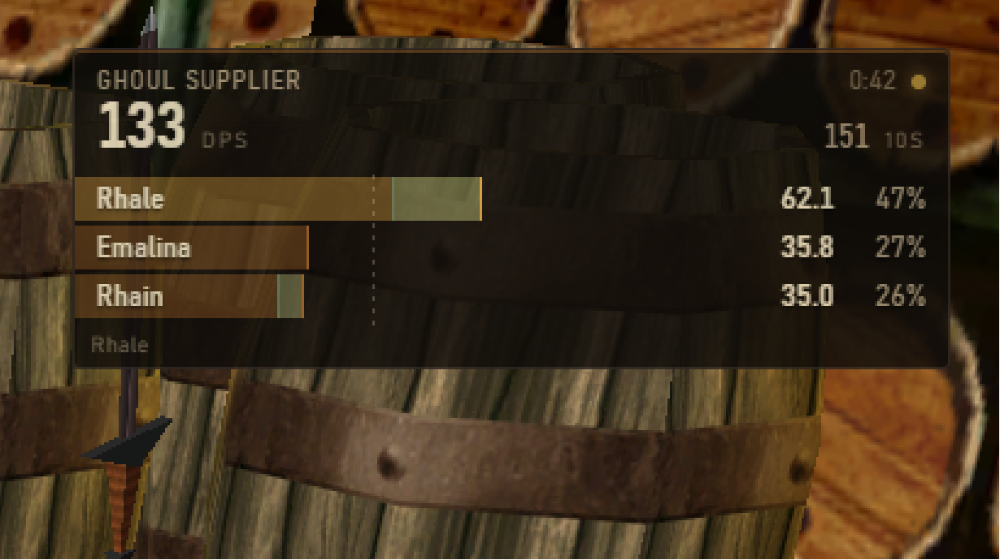

# EQL DPS Overlay

A real-time group DPS meter for **EverQuest Legends**. It tails your chat log and shows
live damage for everyone in your group, with each member's pet folded into their own row.



- **Encounter DPS** as the headline number — total damage ÷ fight duration, the same
  figure ACT and GamParse report — with a rolling 10-second reading beside it for burst
  feedback.
- **One row per member**, sorted highest first. The row *is* the bar: its fill is that
  member's share of group damage, and a pet's contribution is carved out of the end of
  its owner's fill in green.
- **Healing too.** `Ctrl+Shift+M` flips the same rows to HPS, recolored teal so the two
  modes are never confusable at a glance. Overhealing is reported exactly, not estimated
  (see below), so you can see how much of a heal actually landed.
- **Hover any row** for the full breakdown: player vs. pet split, damage by source,
  top abilities, hits, misses, crits, accuracy and biggest hit — or, in healing mode,
  overhealing, efficiency and who you healed.
- **Click-through by default**, so it never steals a click from the game.

## Sending it to someone else

`scripts/dev.sh dist` produces a single portable executable at
`C:\eqoverlay-dev\dist\EQL-DPS-Overlay-<version>.exe` (~74 MB). No installer, no Node,
no dev toolchain — copy the file and run it.

It is **not code-signed**, so Windows SmartScreen shows "Windows protected your PC" on
first run: *More info* → *Run anyway*. Signing needs a paid certificate.

On first launch it opens the setup screen, finds the default Logs folder, and preselects
whichever `eqlog_*.txt` was written most recently — so on a machine with several
characters it lands on the one being played, and any of the others can be picked from the
list. Settings live in `%APPDATA%\eq-legends-dps-overlay`, separate from the app itself.

## Running it

```bash
scripts/dev.sh install     # sync to C:\eqoverlay-dev and install (first time)
scripts/dev.sh start       # run the overlay
scripts/dev.sh dist        # build a portable .exe into C:\eqoverlay-dev\dist
scripts/dev.sh test        # run the test suite in WSL
```

Source is edited in WSL; the app runs as a native Windows process, because that is what
it takes to float above the game. `dev.sh` mirrors the tree to `C:\eqoverlay-dev` and
drives the Windows `npm` there so `npm install` fetches the win32 Electron binary.

On first run a setup screen finds your Logs folder, lists the `eqlog_*.txt` files it
contains, and preselects the most recently written one. Reopen it any time from the
**settings** button (unlock the overlay first) to change opacity, scale, combat timeout,
hotkeys and pet ownership.

### Hotkeys

| | |
|---|---|
| `Ctrl+Shift+L` | Lock / unlock. Unlocked, the overlay can be dragged and resized and its buttons appear. |
| `Ctrl+Shift+H` | Show / hide. |
| `Ctrl+Shift+R` | Reset the current encounter. |
| `Ctrl+Shift+M` | Switch between damage and healing. |

## Things worth knowing

These are properties of EverQuest, not bugs in the overlay, but they will look like bugs
if you do not know about them.

**Logging must be on.** Type `/log on` in game. The setup screen warns you if the log
file looks stale.

**The log only records what your client sees.** A group member fighting in another room,
or damage beyond your client's range, never reaches the log and cannot be counted. Your
numbers can legitimately disagree with someone else's parse of the same fight.

**Exclusive fullscreen hides the overlay.** Run the game borderless/windowed. No
always-on-top window can draw over an exclusive-fullscreen application on Windows.

**Named pets need to be told apart from players.** A pet called `` Rhale`s warder `` is
folded into Rhale automatically — the name says who owns it. A *summoned* pet gets a
proper name like `Gann`, which is shaped exactly like a player name, and the log never
says whose it is. Your own pet is detected automatically the first time it reports to you
as "Master"; for anyone else's, add a line under **Named pets** in settings:

```
Gann = Rhain
```

Until you do, the pet keeps its own row — its damage is still counted, never silently
dropped.

**Charmed mobs are credited to the charmer.** A charmed mob keeps its mob name
(`a tal ghoul wizard`) but fights for you, and its damage counts as the charmer's pet
damage. EverQuest Legends announces `a tal ghoul wizard has been charmed.` but names no
caster, so the charmer is identified as the friendly whose in-flight spell was a charm
spell — matching on the spell name, since several people are usually casting at once.
With no charm spell in flight, nobody is credited rather than a guess being made.

There is **no charm-break message in the log at all**, so the end of a charm is inferred:
the ex-pet hitting the group, the group hitting it, its death, or zoning. Two limitations
follow. Mob names are generic, so if two `a tal ghoul wizard` are up and one is charmed,
the other's damage is credited too. And because a break is only noticed on the next
relevant line, a few swings after a silent break can land on the charmer.

**Overhealing is exact.** EverQuest writes `healed Rhain for 119 (139) hit points` —
what actually landed, then what the spell would have restored — and prints the
parenthetical *only* when the two differ. So a heal with a single number wasted nothing,
and overhealing is a real figure rather than an estimate. A healer whose every point
overhealed still gets a row, showing 0 healing and their overheal: that is the case most
worth seeing, so it is never filtered out.

**Healing never starts or extends a fight.** Only damage does. Otherwise topping the
group up between pulls would open an encounter with no damage in it, whose duration then
grows until the idle timeout and drags the next real fight's DPS down.

**Timestamps have one-second resolution.** Very short fights therefore produce noisy DPS.
Encounter duration is floored at one second so a burst inside a single second reports as
"all of it in one second" rather than dividing by zero.

**An `Unknown` row means damage could not be attributed.** EverQuest Legends names the
caster on essentially all spell and proc damage, so this should be rare. If it appears
often, the rules need extending — see below.

## When the numbers look wrong

`collect-unknown.js` reports every log line no rule matched, grouped by shape:

```bash
node scripts/collect-unknown.js "/path/to/eqlog_You_server.txt"
```

Anything in `unknown-lines.txt` containing `damage`, `hit` or `slain` is a gap in
`src/parser/rules.js`. On the reference session, 310 of 657 lines matched and **zero**
unmatched lines contained any combat wording — the rest is flavor text.

To work on the UI with the game closed, replay a saved log into a file and point the
overlay at it:

```bash
node scripts/replay.js tests/fixtures/combat-sample.log --print
node scripts/replay.js tests/fixtures/combat-sample.log --write /tmp/eqlog_Rhale_oggok.txt --speed 5
```

`--print` parses the whole log and prints every encounter it found, which is the quickest
way to check a parsing change against a real session.

## How it is put together

```
src/parser/     pure ES modules, zero Electron imports — unit tested with node --test
  timestamp.js  [Ddd Mmm D HH:MM:SS YYYY] -> epoch ms
  rules.js      ordered regex table -> typed events (chat first, so quoted combat is safe)
  entities.js   "You" -> your name; <Owner>`s <pet> -> owner
  roster.js     who counts as "us"; pet ownership; player vs NPC
  encounter.js  fight state machine and per-combatant aggregation
  index.js      LogParser: feed(line) in, snapshot() out
src/main/       Electron main: windows, tailer, config, IPC, hotkeys
src/renderer/   overlay (transparent HUD) and setup (first run + settings)
```

The parser has no Electron dependency on purpose: it can be tested offline, replayed, and
put behind a different front end without a rewrite. The app depends on `electron` alone —
no native modules, so no node-gyp.

## Not in this version

Damage taken, tank metrics, DPS history graphs, encounter export, raid-wide aggregation
beyond your group, and any network sharing between players.
